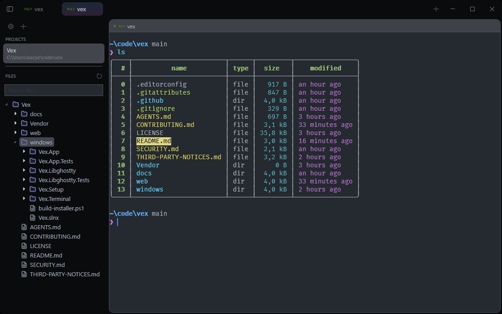

# Vex

Native Windows terminal workspace (WPF, .NET 10): ConPTY sessions, tabs, split panes, file tree, file search, and a built-in editor.



## Features

- Terminal: ConPTY + libghostty-vt emulation, WPF rendering. TUI mouse input, URL underline with Ctrl+Click, keyboard selection, Ctrl+Backspace word delete.
- Shells: auto-detects PowerShell 7, Nushell, Windows PowerShell, cmd, Git Bash, WSL; plus custom shells (program + args) in Settings.
- Tabs & panes: split right/down, focus mode, drag reorder, custom titles, tab peek preview, pane state indicators.
- Workspace: multi-project sidebar, lazy file tree, quick file search, session restore (projects, tabs, splits, focus).
- Editor: AvalonEdit, lazy file load, dark/light syntax themes, dirty indicator, `Ctrl+S` to save.
- Themes: Dark/Light appearance (follows OS), 11 built-in terminal themes + custom theme editor, live picker.

## Shortcuts

| Action | Keys |
|---|---|
| Command palette | `Ctrl+Shift+P` |
| Theme picker | `Ctrl+Shift+M` |
| Tab peek | `Ctrl+Shift+Space` |
| New tab / close | `Ctrl+Shift+T` / `Ctrl+Shift+W` |
| Split right / down | `Ctrl+Shift+R` / `Ctrl+Shift+D` |
| Save file (editor) | `Ctrl+S` |

Plain `Ctrl+<key>` goes to the terminal (TUI apps keep their own bindings). The
full list, including copy, paste, selection, and scroll keys, is in
[docs/shortcuts.md](docs/shortcuts.md).

## Install

Download the installer from [Releases](https://github.com/Rayzerrek/Vex/releases),
or build from source below.

## Documentation

- [docs/architecture.md](docs/architecture.md) — project layout, how output reaches the screen, threading.
- [docs/configuration.md](docs/configuration.md) — `settings.json` and `session.json` reference.
- [docs/shortcuts.md](docs/shortcuts.md) — every keyboard and mouse binding.
- [docs/testing.md](docs/testing.md) — test layers and the renderer self-test harness.
- [CONTRIBUTING.md](CONTRIBUTING.md) — building, testing, and commit conventions.
- [CHANGELOG.md](CHANGELOG.md) — release history.

## Structure

```text
windows/
  Vex.slnx            solution
  Vex.App/            WPF shell: sidebar, tabs, splits, tree, search, editor, overlays
  Vex.Terminal/       ConPTY process lifecycle
  Vex.Libghostty/     libghostty-vt wrapper + WPF rendering
  Vex.Setup/          WiX installer
Vendor/libghostty/    ghostty-vt native lib
web/                  landing page
```

Config: `%LocalAppData%\Vex\settings.json`, `%LocalAppData%\Vex\session.json`.

## Requirements

- Windows 10 1809+ / Windows 11
- .NET 10 SDK

## Build and Run

```powershell
dotnet build windows/Vex.slnx
dotnet run --project windows/Vex.App
```

To build the self-contained executable and the MSI installer:

```powershell
pwsh windows/build-installer.ps1
```

## Third-party components

Vex bundles and depends on third-party software, including Ghostty's
`ghostty-vt` and AvalonEdit. See
[THIRD-PARTY-NOTICES.md](THIRD-PARTY-NOTICES.md).

## License

[GPL-3.0](LICENSE)
